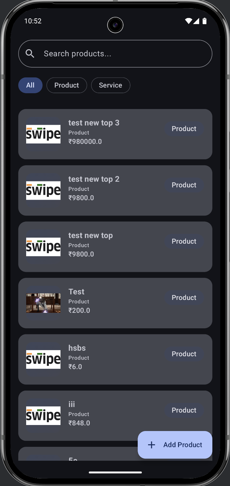
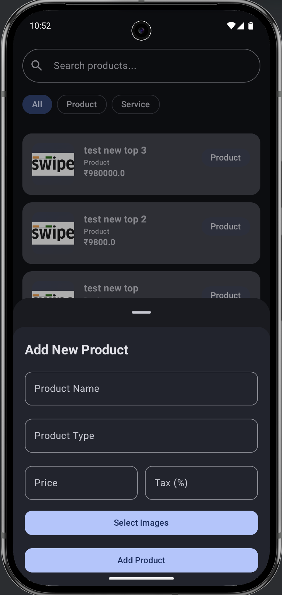

# 📱 Swipe Assignment — Android Product Manager App

A modern **Android application** built using **Jetpack Compose**, designed as part of the Swipe assignment. The app enables users to **add, view, and manage products**, featuring a **clean UI** and a **scalable MVVM + Clean Architecture**.

---

## ✨ Key Features

This application showcases several modern Android development practices:

* 🖼️ **Splash Screen**: Implemented using the **Android 12+ Splash API** for a smooth, animated launch.
* 🆕 **Add Product**: Functionality for adding product name, type, price, and selecting **multiple images**.
* 📋 **Product Listing**: Displays product data fetched from the network, supported by **offline caching**.
* 🗃️ **Data Persistence**: Integration of **Room Database** for robust local storage and offline support.
* 🔄 **Real-time Sync**: Ensures seamless synchronization between the local **Room DB** and the network data.
* 🧭 **Architecture**: Uses **MVVM with Clean Architecture** principles for enhanced scalability, maintainability, and testability.
* 🌐 **API Integration**: Handled efficiently with **Retrofit** and **Kotlin Coroutines**.
* 🧰 **Modern UI**: Fully built with **Jetpack Compose** following current **Material 3** design guidelines.

---

## 🧭 Project Architecture

The project follows the standard modular structure of Clean Architecture:

| Directory | Purpose |
| :--- | :--- |
| `presentation/` | Contains the UI layers (**Compose Screens**) and their corresponding **ViewModels**. |
| `data/` | Houses the data sources: **local** (`Room`), **remote** (`Retrofit`), **mappers**, and **repository implementation**. |
| `domain/` | Defines the business logic: **domain models**, **use cases** , and **repository interfaces**. |
| `core/` | Contains cross-cutting concerns like utility classes (`util/`), constants, and resource handling. |

---

## 🧪 Tech Stack & Libraries

| Category | Technology/Library | Notes |
| :--- | :--- | :--- |
| **Language** | **Kotlin** | |
| **UI Toolkit** | **Jetpack Compose** | Fully declarative UI, leveraging **Material 3** components. |
| **Architecture** | **MVVM + Clean Architecture** | For separation of concerns and testability. |
| **Networking** | **Retrofit** + **OkHttp** | For REST API communication. |
| **Persistence** | **Room Persistence Library** | For local data caching and offline support. |
| **Concurrency** | **Kotlin Coroutines** | For non-blocking, asynchronous operations (e.g., API calls, DB transactions). |
| **Dependency Injection** | **Koin** | For robust and scalable dependency management. |
| **State Management** | **StateFlow** | Used in **ViewModels** to expose reactive data streams to the UI. |
| **Image Handling** | **Activity Result API** | Used with `rememberLauncherForActivityResult` for image picking. |

---

## 🧰 Detailed Functionality Overview

### 1. Data Flow & Persistence
* **Offline Support**: Product data is cached locally in **Room**.
* **Synchronization**: Upon successful network connection, the local state is seamlessly synced with the remote API.
* **Mapping**: Network responses are reliably converted to domain models using dedicated **Mapper** classes before being processed by the application.

### 2. User Experience
* **Splash Screen**: Leverages the dedicated Android 12+ API for a native, performant launch experience.
* **Add Product**: The form handles all necessary product details and uses the **Activity Result API** for efficient image selection.
* **State Management**: A generic `UiState<T>` class is used across the presentation layer to clearly manage and reflect **Loading**, **Success**, and **Error** states in the UI.

---

## 📸 Screenshots




## 🧑‍💻 How to Run

1.  **Clone the Repository**:
    ```bash
    git clone [https://github.com/your-username/swipe-assignment.git](https://github.com/your-username/swipe-assignment.git)
    cd swipe-assignment
    ```
2.  **Open in Android Studio**:
    * Open the project in **Android Studio** (Giraffe or newer is recommended).
3.  **Sync and Build**:
    * Wait for **Gradle** to sync all dependencies.
4.  **Run the App**:
    * Select an emulator or a physical device and run the application.
